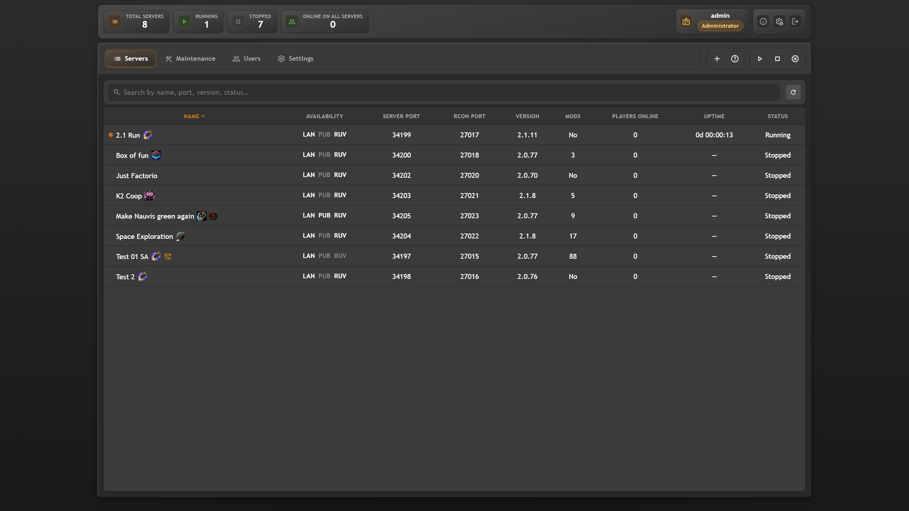
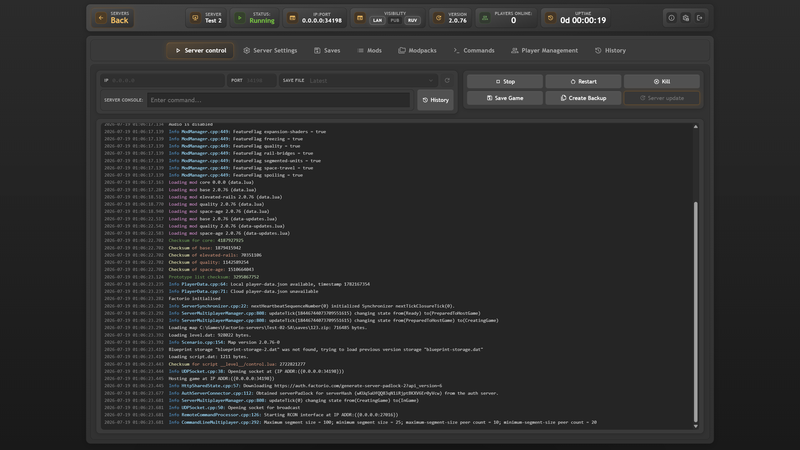
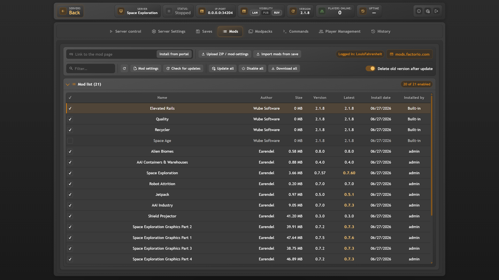
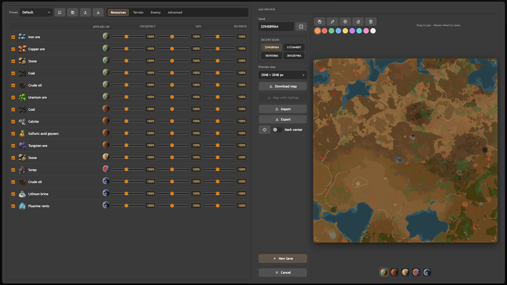
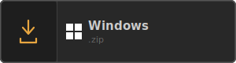
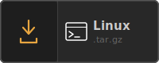

# Factorio Control Center

Web panel for managing Factorio dedicated servers in your browser. Install on
your PC or VPS — add servers and manage everything from one place.

<p align="center">
  
  
  
  
</p>

**Русский:** [README.ru.md](README.ru.md)

**Translations:** [TRANSLATING.md](TRANSLATING.md)

## Features

**Server**

- Start, stop, and restart
- Live server log and history
- RCON console
- Server updates via the official API
- Multiple servers in one panel — not enough? Just make more
- Full automatic setup for a new server — just create or upload a save to get started
- Protection against accidental updates

**Saves**

- Save management: list, upload, download, delete, rename, copy
- Built-in map generator with all in-game settings
- `.fcc` presets — save generator settings, export a file, and share it

**Mods**

- Enable and disable mods, change versions without removing them
- Download and update mods from the Factorio mod portal
- Upload mods from disk
- Import mods from a save
- Automatic dependency resolution — the panel finds missing mods and offers to download them from the portal
- Built-in mod settings editor
- `.fcc` modpacks — export, share, and import on another panel; mods download from the portal; you can also copy the modpack folder directly
- Symlink support for modpacks

**Players and moderation**

- Who is online, uptime, and server stats
- Chat log and sending messages to players
- Full moderation tools
- Admin, ban, and whitelist lists; optionally shared across all servers
- In-game announcements

**Settings and commands**

- Edit `server-settings.json` in the UI
- Built-in RCON command catalog and custom command editor
- Scheduled server and mod updates — weekly, with timezone support
- Shared Factorio portal username and token for all servers

**Access and UI**

- Roles: administrator, server engineer, moderator — per-tab and per-server permissions
- Full desktop UI and a simplified mobile view
- English and Russian UI
- Several themes — all dark. No light mode; without lights and concrete, it's just a starter base anyway

## Requirements

- **OS:** Windows 10+ or Linux (systemd)
- **[Node.js 24+](https://nodejs.org/)**
- **Factorio dedicated server** — already on disk, or download via the panel when creating a server
- **[Factorio account](https://factorio.com/profile)** — needed to download / update the server and fetch mods from `mods.factorio.com`

  Set **Username** and **Token** under **Settings → Global username / Global token**.
  Without them you can still run a manually installed server, but portal downloads
  and in-panel updates will not work.

## Install and run

<p align="center">
  <a href="https://github.com/LouisFahrenheit/Factorio-Control-Center/releases/latest">
    
  </a>
  &nbsp;&nbsp;
  <a href="https://github.com/LouisFahrenheit/Factorio-Control-Center/releases/latest">
    
  </a>
</p>

1. Download the release from GitHub Releases.
   - **Windows** — unpack and run **`Start.bat`**.
   - **Linux** — **Quick start**:
     ```bash
     bash -c "$(curl -fsSL https://raw.githubusercontent.com/LouisFahrenheit/Factorio-Control-Center/main/install.sh)"
     ```
     Or manual install: download `factorio-control-center-linux.tar.gz` to `/opt`, then:

     ```bash
     cd /opt && sudo tar -xzf factorio-control-center-linux.tar.gz && cd /opt/factorio-control-center && sudo chmod +x Start.sh && sudo ./Start.sh
     ```

2. In the menu — **1. Start panel**, open the URL from the output: `http://127.0.0.1/` on your PC, `http://server_IP/` on a VPS (port — shown in the menu).
3. Log in: `admin` / `admin` — change the password right away.

### Autostart (Service Installation)

You can configure the panel to start automatically when your system boots. In the main menu, select **3. Install service**. 

- **Windows:** Run **`Start.bat` as Administrator** before installing the service.
- **Linux:** If you run the panel as `root`, it installs a system-wide service. If you run it as a normal user, it installs a user service.

**Note for Linux user services:** To ensure the panel starts at boot without requiring you to log in, enable lingering for your user:

```bash
sudo loginctl enable-linger $USER
```

**Firewall:** Factorio's UDP port opens automatically only when running as admin/root — otherwise set it up yourself.

**Panel ports:**

- **Auto** — on Linux without root: **8080** (HTTP) or **8443** (HTTPS); otherwise **80** / **443**
- **Custom** — your port in settings or `fcc-settings.ini` (`port_mode=custom`, `listen_port=…`)

The start menu shows the URL to open.

## Development

Use **`StartDEV.bat`** or **`StartDEV.sh`** — dev/prod run, build, pack release.

```bash
git clone https://github.com/LouisFahrenheit/Factorio-Control-Center.git
cd Factorio-Control-Center
```

Or manually:

```bash
npm install
npm install --prefix client
npm run start:dev      # API
npm run client:dev     # UI → http://127.0.0.1:5173/login
```

Local release build: `npm run pack:release` → `release/factorio-control-center-win.zip` and `release/factorio-control-center-linux.tar.gz`.

## Security

Do not publish or commit `fcc-settings.ini`, `data/`, tokens, or TLS keys.
