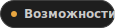
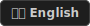
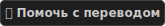
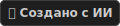

<p align="center">
  
</p>

<p align="center">
  <a href="#features"></a> &nbsp;
  <a href="#requirements"></a> &nbsp;
  <a href="#install-and-run"></a> &nbsp;
  <a href="#development"></a>
</p>

Веб-панель для управления выделенными серверами Factorio в браузере. Ставится на
ПК или VPS: добавляете серверы и управляете всем из одного места.

<p align="center">
  
  
  
  
</p>

<p align="center">
  <a href="README.md"></a> &nbsp;
  <a href="TRANSLATING.md"></a> &nbsp;
  
</p>

<h2 id="features"></h2>

**Сервер**

- Запуск, остановка и перезапуск
- Лoг сервера и история
- RCON-консоль
- Обновление сервера через официальный API
- Несколько серверов в одной панели
- Автоматическая настройка нового сервера
- Блокировка от случайных обновлений

**Сохранения**

- Управление сохранениями: список, загрузка, скачивание, удаление, переименование, копирование
- Встроенный генератор карты со всеми настройками, доступными в игре (Vanilla и Space Age)
- Пресеты `.fcc` - сохраняет настройки генератора, позволяет экспортировать файл и делиться пресетами

**Моды**

- Включение и отключение модов, смена версий
- Скачивание и обновление модов с портала Factorio
- Локальная загрузка модов с диска
- Импорт модов из сохранения
- Автоматическое разрешение зависимостей
- Встроенный редактор настроек модов
- Модпаки `.fcc` - экспорт, передача и импорт на другой панели (можно также просто скопировать папку модпака)
- Поддержка симлинков для модпаков 

**Игроки и модерация**

- Кто сейчас на сервере, аптайм и статистика
- Лог чата и отправка сообщений игрокам
- Полные возможности модерации
- Списки админов, банов и белых списков; Опционрально - общие для всех серверов
- Система объявления на сервере

**Настройки и команды**

- Редактирование настроек сервера `server-settings.json` в интерфейсе
- Каталог готовых RCON-команд и редактор
- Обновление сервера и модов по расписанию - еженедельно, с учётом часового пояса
- Общий логин и токен портала Factorio для всех серверов

**Доступ и интерфейс**

- Роли: администратор, инженер сервера, модератор - права по вкладкам и по серверам
- Полноценный интерфейс на компьютере и упрощённый вид на телефоне
- Русский и английский язык интерфейса
- Несколько тем - все тёмные.

<h2 id="requirements"></h2>

- **ОС:** Windows 10+ или Linux (systemd)
- **[Node.js 24+](https://nodejs.org/)**
- **Factorio dedicated server** - уже на диске или загрузка через панель при создании сервера
- **[Аккаунт Factorio](https://factorio.com/profile)** - для скачивания / обновления сервера и загрузки модов с `mods.factorio.com`

  Укажите **Username** и **Token** в **Настройки → Глобальный логин /
  Глобальный токен**. Без них можно работать с вручную установленным
  сервером, но загрузки с портала и обновления из панели недоступны.

<h2 id="install-and-run"></h2>

<p align="center">
  <a href="https://github.com/LouisFahrenheit/Factorio-Control-Center/releases/latest/download/factorio-control-center-win.zip"></a>
  &nbsp;&nbsp;
  <a href="https://github.com/LouisFahrenheit/Factorio-Control-Center/releases/latest/download/factorio-control-center-linux.tar.gz"></a>
</p>

1. Скачайте релиз с GitHub Releases.
   - **Windows** - распакуйте, запустите **`Start.bat`**.
   - **Linux** - **Быстрый старт**:
     ```bash
     bash -c "$(curl -fsSL https://raw.githubusercontent.com/LouisFahrenheit/Factorio-Control-Center/main/install.sh)"
     ```
     Или ручная установка (пример для `/opt`): скачайте `factorio-control-center-linux.tar.gz` в `/opt`, затем:

     ```bash
     cd /opt && sudo tar -xzf factorio-control-center-linux.tar.gz && cd /opt/factorio-control-center && sudo chmod +x Start.sh && sudo ./Start.sh
     ```
2. В меню - **1. Start panel**, откройте адрес из вывода: `http://127.0.0.1/` на ПК, `http://IP_сервера/` на VPS (порт - в меню).
3. Вход: `admin` / `admin` - сразу смените пароль.

### Запуск через Docker

**Быстрый старт:**

```bash
bash -c "$(curl -fsSL https://raw.githubusercontent.com/LouisFahrenheit/Factorio-Control-Center/main/install-docker.sh)"
```

Этот скрипт автоматически установит Docker (если его нет), скачает `docker-compose.yml`, загрузит готовый образ и запустит контейнер. После завершения откройте `http://127.0.0.1:8080/` (или IP вашего сервера) и войдите с помощью `admin` / `admin`.

**Ручная установка через Docker:**
1. Скачайте файл `docker-compose.yml`.
2. Выполните команду: `docker-compose up -d`
3. Откройте `http://127.0.0.1:8080/` (или IP вашего сервера) и войдите с помощью `admin` / `admin`.

**Обновление панели (Docker):**
Чтобы обновиться до последней версии (ваши данные не потеряются):
```bash
cd /opt/factorio-control-center
docker-compose pull
docker-compose up -d
```

**Примечание:** По умолчанию `docker-compose.yml` пробрасывает UDP-порты `34197-34207`, что позволяет запускать до 11 серверов Factorio. Вы можете изменить этот диапазон или использовать `host networking`, если вам нужно больше.

### Автозапуск (Установка службы)

Вы можете настроить панель так, чтобы она запускалась автоматически при включении системы. Для этого выберите пункт **3. Install service** в главном меню запуска.

- **Windows:** Перед установкой службы обязательно запустите **`Start.bat` от имени администратора**.
- **Linux:** Если вы запустили панель от `root`, установится системная служба (system-wide). Если от обычного пользователя - установится служба пользователя (user-служба).

**Важно для Linux (user-служба):** Чтобы панель запускалась при загрузке системы без необходимости входа в ваш аккаунт, выполните:

```bash
sudo loginctl enable-linger $USER
```

**Firewall:** UDP-порт Factorio открывается автоматически только от admin/root - иначе настройте вручную.

**Порты панели:** **Настройки → Режим порта**

- **Авто** - на Linux без root: **8080** (HTTP) или **8443** (HTTPS); иначе **80** / **443**
- **Пользовательский** - порт в настройках или в `fcc-settings.ini` (`port_mode=custom`, `listen_port=…`)
  *(Примечание: при использовании Docker не меняйте порт в настройках панели! Изменяйте маппинг портов в файле `docker-compose.yml`)*

Адрес для входа показывается в меню запуска.

<h2 id="development"></h2>

Используйте **`StartDEV.bat`** или **`StartDEV.sh`** - dev/prod, сборка, pack release.

```bash
git clone https://github.com/LouisFahrenheit/Factorio-Control-Center.git
cd Factorio-Control-Center
```

Или вручную:

```bash
npm install
npm install --prefix client
npm run start:dev      # API
npm run client:dev     # UI → http://127.0.0.1:5173/login
```

Локальная сборка: `npm run pack:release` → `release/factorio-control-center-win.zip` и `release/factorio-control-center-linux.tar.gz`.

**Сборка из исходников (Docker):**
Если вы хотите изменить код панели и собрать свой собственный Docker-образ:
1. Склонируйте репозиторий и перейдите в него.
2. В `docker-compose.yml` замените `image: ghcr.io/louisfahrenheit/factorio-control-center:latest` на `build: .`
3. Выполните команду:
   ```bash
   docker-compose up -d --build
   ```

## Безопасность

Не публикуйте и не коммитьте `fcc-settings.ini`, `data/`, токены и ключи TLS.
